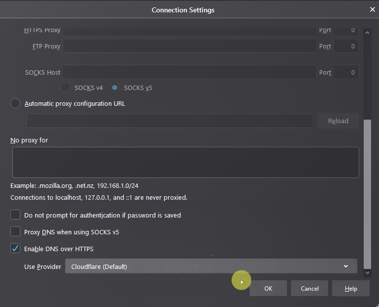
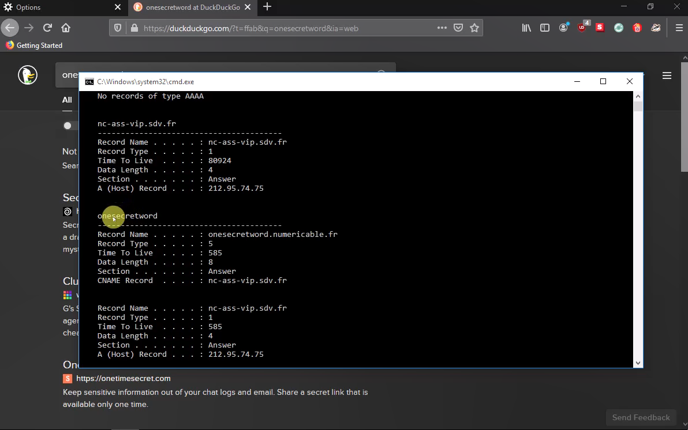

### Credit:
#### Author: duykham
#### Date: 2020-Apr-13

### Affected version:
Firefox 75.0 (64-bit), latest version as of 2020-Apr-13.
Platform: Windows 10

### Title:
User's search term is accidentally sent to ISP without user's consent.

### Category:
DoH, Privacy

### Severity:
High

### Description:
When an user types a search term (e.g. "a-very-sensitive-word") into the address bar and enter, the quick search feature will bring up search results from a search engine (either from Google or DuckDuckGo) which is an expected behavior.
However, the search term ("a-very-sensitive-word") is also "mistakenly" sent to one of the (DNS) servers of the user's ISP. The user's privacy is compromised.

The issue happens even if DoH (DNS over HTTPS) is in place. Even though, this should not happen in any circumstances, with or without DoH. Any information users type or search for must not not be sent out (especially to the ISP) without the users' consent.

### Other observation:
- The issue only happens when the search term is ONE word ("word", "one-word", "many-words-without-spaces"... are eligible ones).
- The issue does not occur when the search term consist of multiple words (i.e. "this will not cause the issue").
- ISP's server address is set (by default) as one of the "Connection-specific DNS suffixes". THIS IS THE MOST IMPORTANT POINT!

### Details:
- The user wants the highest level of security & privacy, so he already enabled DoH in Firefox setting.

- He also set DuckDuckGo as the default search engine in Firefox, to protect his privacy.
- He types some random search in the address bar of Firefox.

- He wants to confirm if DoH really works by checking DNS logs (with command "ipconfig /displaydns").
- SURPRISINGLY, the term he used for his search apeared in the DNS log, in one of the queries sent to ISP's servers.

### Analysis:
- An ISP's server address is set as one of the "Connection-specific DNS suffixes", when DHCP is used.
- With a DNS suffix is set, Firefox (mis-)interpret the search term (followed by the suffix, "search-term.[suffix]") as a potentially-valid domain name and therefore sends a DNS query to ask for its IP address.
- The problem is, despite the fact that DoH is enabled by the user, when sending the DNS query, Firefox does not treat the "search-term.[suffix]" in the same way as other domain names and therefore send it in plain text.
- As a consequence, the DNS query is logged and the search-term is recorded and sent to the suffix server (which belongs to ISP), without user's consent.

### Suggested mitigation:
- Do not send any DNS query for a search term (as it currently does when user searches with multiple separated words).
- If somehow DNS query is still needed (by designed), check the DoH setting and apply DoH for the DNS query.

### Impact/Risk:
- The ISP can track user's activities and use his searching history for the purposes against the user.
- A malicious actor on the network can setup a rogue DHCP server and intentionally set the user's DNS suffixes to one of the attacker's servers. By monitoring that server, the attacker can track the user's activities and use his searching history for malicious purposes (e.g. selling data, advertising, ransom,...)

### Mitigation (temporary workaround until Firefox provides the fix):
- Set IP address manually (do not use DHCP).
- Make sure DNS suffixes do not consist of any unusual addresses.

### Timeline
- 2020/04/13: Sent bug reports to both Firefox (at security@mozilla.org) and [Chrome](https://bugs.chromium.org/p/chromium/issues/detail?id=1070282).
- 2020/04/14: Google team replied. There was a similar bug ([#479620](https://crbug.com/479620)) in their bug-tracking system but no-one had fixed yet. No responses from Firefox team.
- 2020/05/13: Sent another reminder to Firefox team at email address: security@mozilla.org.
- 2020/05/31: Still no reponses from Firefox team.
